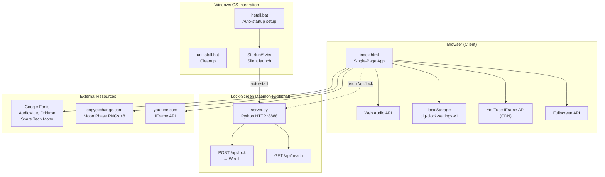
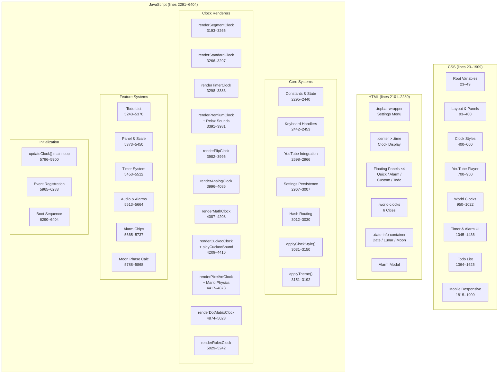
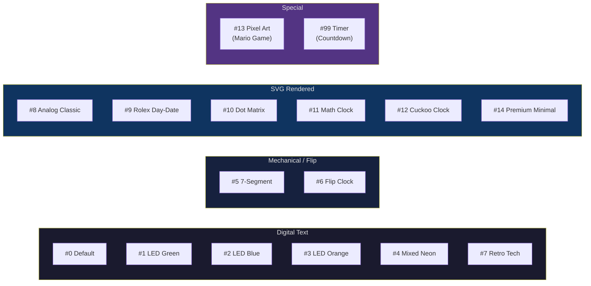
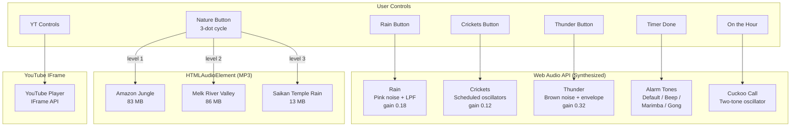
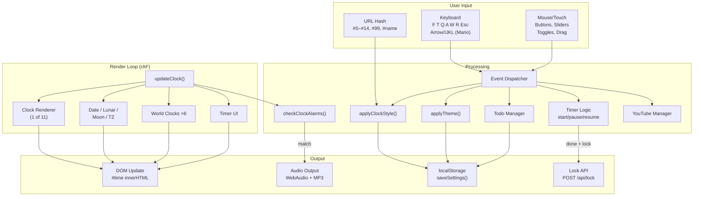
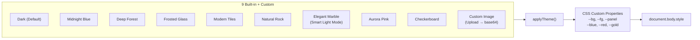
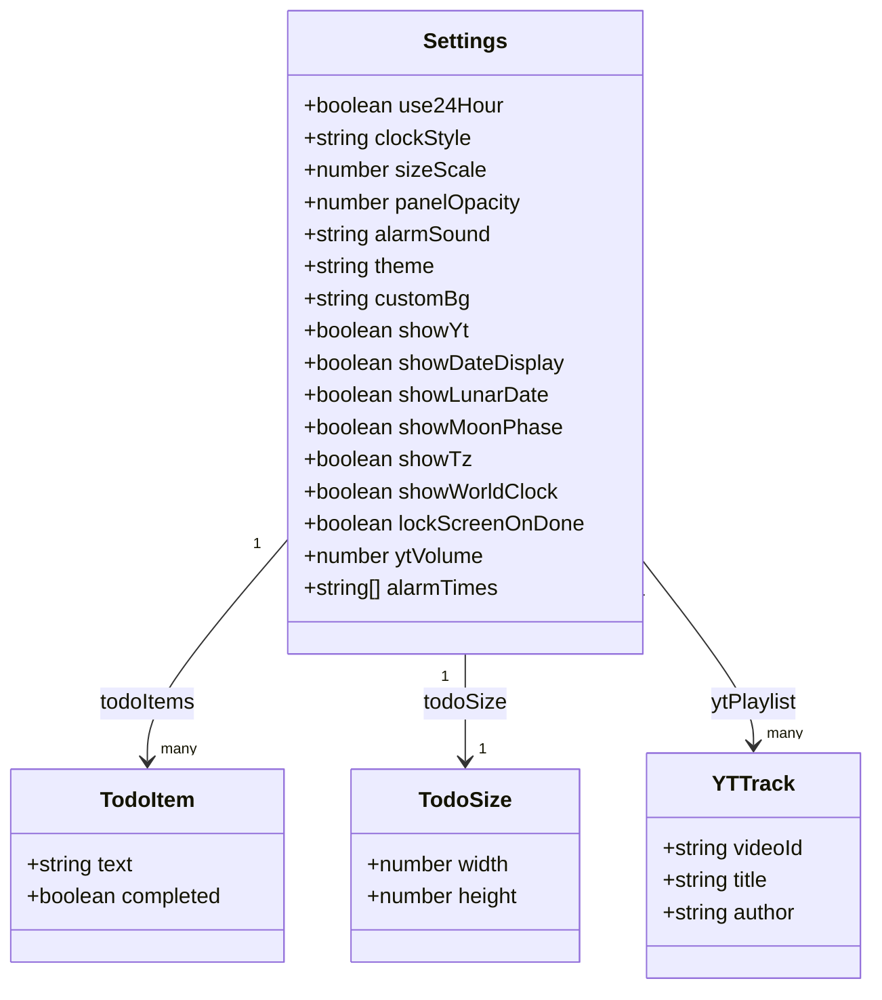
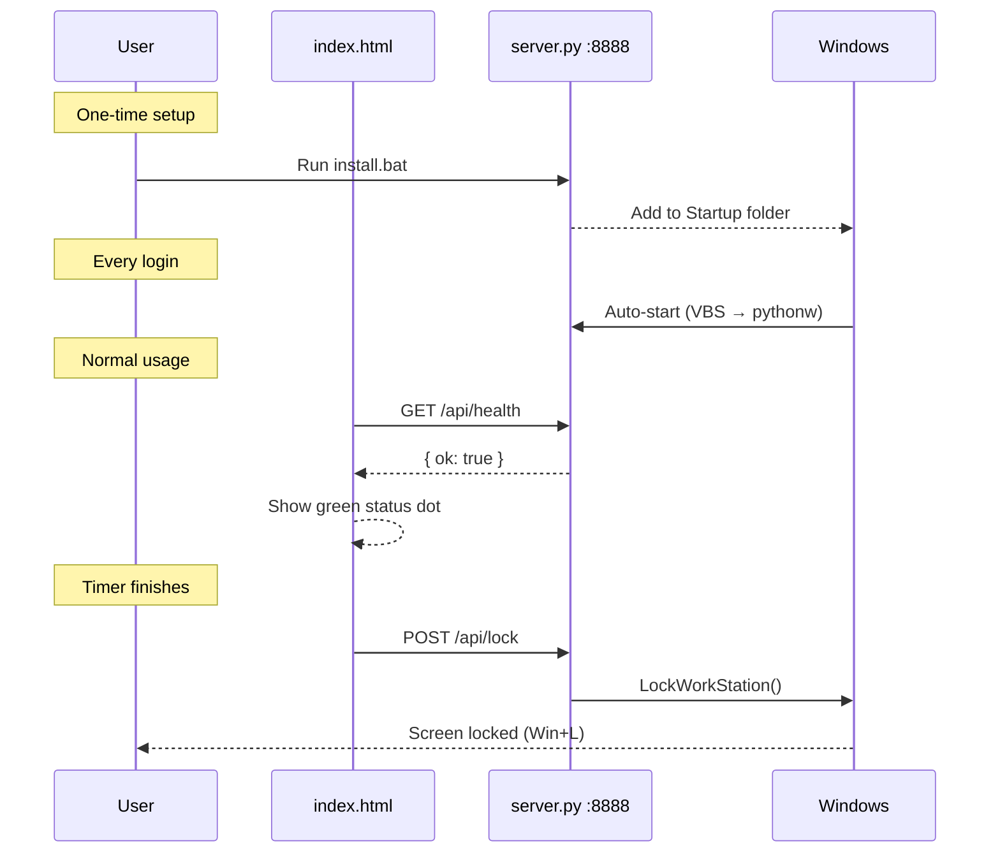

# Big Clock — Architecture Diagram

## Overview

```
index.html (6,400 lines, single file)
├── CSS    (lines 23–1909)      — Styling, themes, responsive
├── HTML   (lines 2101–2289)    — DOM structure, panels, modals
└── JS     (lines 2291–6404)    — All application logic
```

---

## 1. System Architecture



---

## 2. Application Layers

```mermaid
graph LR
    subgraph Rendering["Rendering Layer"]
        direction TB
        R1["updateClock()<br/>Main rAF Loop ~60fps"]
        R1 --> R2["Clock Dispatcher"]
        R2 --> CS1["renderStandardClock"]
        R2 --> CS2["renderSegmentClock"]
        R2 --> CS3["renderFlipClock"]
        R2 --> CS4["renderAnalogClock"]
        R2 --> CS5["renderRolexClock"]
        R2 --> CS6["renderDotMatrixClock"]
        R2 --> CS7["renderMathClock"]
        R2 --> CS8["renderCuckooClock"]
        R2 --> CS9["renderPixelArtClock"]
        R2 --> CS10["renderPremiumClock"]
        R2 --> CS11["renderTimerClock"]
    end

    subgraph State["State Layer"]
        direction TB
        S1["Clock Style & Theme"]
        S2["Timer / Alarm State"]
        S3["Todo Items"]
        S4["YouTube Playlist"]
        S5["Relax Sound Toggles"]
        S6["Toggle Visibility Flags"]
    end

    subgraph Persist["Persistence"]
        LS2["localStorage<br/>saveSettings()<br/>loadSettings()"]
    end

    State --> Persist
    Rendering -.->|reads| State
```



---

## 3. Module Map (by line range)



---

## 4. Clock Styles (16 total)



---

## 5. Audio System



---

## 6. Data Flow



---

## 7. Theme System



---

## 8. localStorage Schema



---

## 9. Lock-Screen Service



---

## 10. File Map

```
big-clock/
├── index.html              ← Entire app (HTML + CSS + JS)
├── server.py               ← Lock-screen HTTP daemon
├── install.bat             ← Windows auto-startup installer
├── uninstall.bat           ← Remove from startup
├── start.bat               ← Open browser to localhost
├── robots.txt              ← SEO
├── sitemap.xml             ← SEO
├── README.md               ← Documentation + screenshots
├── ARCHITECTURE.md         ← This file
└── assets/
    ├── app-screenshot.png
    ├── screenshot-*.png    ← 16 clock style previews
    ├── *.mp3               ← Nature sound recordings (4 files)
    ├── *Moon*.png           ← Moon phase images (8 phases)
    ├── marble.png           ← Theme backgrounds
    ├── rock.png
    ├── tiles.png / tiles2.png
    └── ...
```

---

## Quick Reference: Where to Edit

| Want to change...          | Go to (line ~)       |
|---------------------------|----------------------|
| Add new clock style       | New `render*()` + register in `STYLE_BY_NUM`, `applyClockStyle()` switch, `ALL_CLOCK_STYLES` |
| Add new theme             | `applyTheme()` (~3151) + dropdown HTML (~2170) |
| Change timer behavior     | `startTimer/pauseTimer/resumeTimer` (~5480) |
| Modify alarm sounds       | `playAlarmBurst()` (~5524) |
| Add new ambient sound     | `relaxState` + new `start*Sound()` + button in `renderPremiumClock` |
| Change persistence schema | `saveSettings()` (~2976) + `loadSettings()` (~2967) |
| Add world clock city      | HTML (~2236) + `updateClock()` world clock section |
| Mobile layout tweaks      | `@media (max-width: 768px)` (~1815) |
| Hash shortcut for new style | `STYLE_BY_NUM` map (~3012) |
