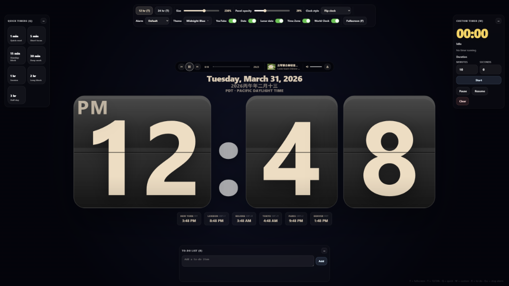

# big-clock

A fullscreen web clock with large display styles, floating timers, world clocks, dynamic themes, alarm effects, and a highly interactive layout.



## Features

- **Large Centered Fullscreen Clock**
- **YouTube Music-Style Player**: 
    - Floating glassmorphic control bar.
    - **Radio Mix Integration**: Automatically generates an infinite queue of related music when playing a single video.
    - **History Navigation**: Intelligent "Previous" button that tracks your played videos.
    - Persistence for volume and tracks.
- **Dynamic Date & Timezones**: Automatically positioned date, timezone, and Chinese Lunar Date display.
    - **Decoupled Visibility**: Toggle each element (Date, Lunar, TZ) independently.
- **Expanded World Clocks**: Live pinned clocks for New York, London, Beijing, **Tokyo (JST)**, **Paris (CET)**, and **Denver (MST/MDT)**.
    - Includes timezone abbreviations for each city.
- **Multiple Clock Styles**: Default, LED Neon Green/Blue/Orange, Mixed Neon, 7-Segment, Flip Clock, Retro Tech, **Analog Classic** (SVG wall-clock face with Arabic numerals, black hour/minute hands, and a sweeping red second hand), **Rolex Day-Date** (faithful SVG recreation of the Day-Date 40 ref. 228238 — green ombré sunburst dial, 44-segment fluted gold bezel, upright gold Roman numerals rotated radially, arch-shaped day-of-week aperture with arced lettering, date window at 3 o'clock, gold sword hands, Rolex inscriptions, and a full President bracelet above and below the case), **Dot Matrix** (LED dot matrix display with 5×7 green dot-grid digits, a 60-dot seconds ring with red hour markers, blinking colon, smaller seconds readout, and glow effects on a dark circular face), **Math Clock** (artistic wall clock with mathematical expressions for each hour — binary, trig, roots, factorials, fractions, and constants — serif font on a clean white face with "Science & Democracy" branding), **Cuckoo Clock** (SVG recreation of a modern cuckoo clock with blue arch body, honeycomb-staggered dimple grid, orange hour markers integrated into the grid, animated white bird that emerges on the hour, manual cuckoo trigger button, and Web Audio cuckoo sound), **Pixel Art Scene** (Mario-themed retro LED pixel art clock with dual NES brick blocks for hours and minutes, blinking colon, classic Mario sprite with full keyboard controls and platformer physics, ? block with spinning gold coin and full-screen fireworks on head bump, green pipe with entry/teleport animation, drifting clouds, green hills, NES brick ground, and scrolling date marquee in the sky), and **Timer** (large countdown display with circular SVG progress ring, blinking colon, color-coded status indicator, syncs with existing Quick/Custom timer controls).
- **Premium Built-in Themes**: 
    - **Dark (Default)**: Classic minimalist deep black.
    - **Midnight Blue / Deep Forest**: Elegant dark gradients.
    - **Frosted Glass**: Sophisticated blurred acrylic look.
    - **Modern Tiles**: Architectural charcoal tile pattern.
    - **Natural Rock**: Tactile dark slate stone texture.
    - **Elegant Marble**: High-end white marble (features **Smart Light-Mode** which automatically inverts text for readability).
    - **Aurora Pink**: Vibrant purple-to-pink gradient.
    - **Checkerboard**: Black & white marble tile pattern.
    - **Custom Image Background**: Upload your own image via the sub-menu.
- **Adjustable Display**: Scale the main clock size, or adjust UI panel opacity.
- **Interactive To-Do List**: Built-in floating to-do list featuring native **HTML5 Drag & Drop sorting**, one-click item removal, and a **Clear All** button (🗑) with confirmation to wipe the entire list.
- **Floating Timers**: Persistent quick timer presets (1 min → 3 hr) with toggle-off on second click, plus a custom minutes/seconds timer with pause, resume, clear, and an optional **Lock Screen on Done** toggle that triggers Windows system lock (Win+L) when the timer finishes.
- **Alarm Panel**: Dedicated alarm panel (hotkey `A`) for setting clock-based alarms — create time chips via typing or the 🕐 picker button, toggle alarms on/off by clicking, delete individual alarms, and time display respects the 12/24hr mode. Uses the same alarm sound and shake effect as the timer. Fully persistent across sessions.
- **Alarm Customizations**: Choose between Default, Digital Beep, or Marimba. Features an auto-firing screen shake effect and an alarm stop modal.
- **Auto-Hiding Menus**: The settings menu cleanly tucks itself into a capsule icon when your mouse leaves the area.
- **iOS-Style Toggles**: Premium toggle switches in the settings bar for all major sections (YouTube, Date, Lunar, TZ, World Clock).
- **Local Persistence**: Remembers literally everything contextually (clock style, theme, custom background, sounds, active to-dos, panel opacities, and collapsed states).
- **Mobile Portrait (竖屏) Support**: Fully responsive layout for phones — sticky settings header, stacked panels, compact quick-timer chips, and collapsible timer panels with an in-panel +/− toggle.

## Controls / Hotkeys

### Main Controls
- `F` — Toggle Fullscreen (Hint: **Fullscreen (F)**)
- `T` — Toggle 12/24 Hour Mode (Hint: **12/24 hr (T)**)

### Panel Controls
- `Q` — Toggle Quick Timers panel (Hint: **Quick timers (Q)**)
- `A` — Toggle Alarms panel (Hint: **Alarms (A)**)
- `W` — Toggle Custom Timer panel (Hint: **Custom timer (W)**)
- `R` — Toggle To-Do List panel (Hint: **To-do list (R)**)

### Pixel Art Scene — Mario Controls
- `←` / `→` (or `J` / `L`) — Walk left / right
- `↑` (or `I` or `Space`) — Jump (variable height: tap for short, hold for high)
- `↓` (or `K`) — Crouch / Enter pipe (when standing on pipe)

### Alarm Controls
- `Esc` — Stop active alarm (or click the **Stop** button)

## Running Locally

Because Big Clock is built purely natively, just open `index.html` in any browser!

**Note for YouTube Player**: Due to security restrictions on the YouTube IFrame API, the player functionality requires the page to be served via a local HTTP server (e.g., `python -m http.server 8888`) and accessed via `http://localhost:8888/`.

For best results:
- Use Chrome, Edge, or Firefox.
- Hit `F` to enter fullscreen mode.
- Allow sound so timer alarms can play through the Web Audio API without interruption.

**Lock Screen on Timer Done** (Windows, optional):

The "Lock screen when done" toggle in Custom Timer triggers a real Windows system lock (Win+L) when the timer finishes — useful for enforcing screen breaks. This works from **any** URL, including `https://bsb3166.github.io/big-clock/`.

Setup (one-time):
```
install.bat            → install background service to Windows auto-startup
uninstall.bat          → remove from startup
```
Run `install.bat` once — a tiny background daemon starts on every login (port 8888, no console window). The webpage calls `http://localhost:8888/api/lock` to trigger Win+L. Chrome allows HTTPS pages to access localhost, so it works seamlessly from GitHub Pages.

To also serve the app locally, use `start.bat` (opens browser to `http://localhost:8888`).

## GitHub Pages Setup

This repo is completely compatible with GitHub Pages.

To deploy it globally:
1. Open your repo on GitHub.
2. Go to **Settings** → **Pages**.
3. Under **Build and deployment**:
   - **Source**: `Deploy from a branch`
   - **Branch**: `main`
   - **Folder**: `/ (root)`
4. Save. GitHub will publish it to `https://<your-username>.github.io/big-clock/`.

## Built With
- Pure HTML5 / CSS3 / Vanilla JavaScript.
- YouTube IFrame API.
- Native HTML5 Drag and Drop API.
- Native `Intl.DateTimeFormat` for dates, zones, and calendars.
- Zero dependencies.
